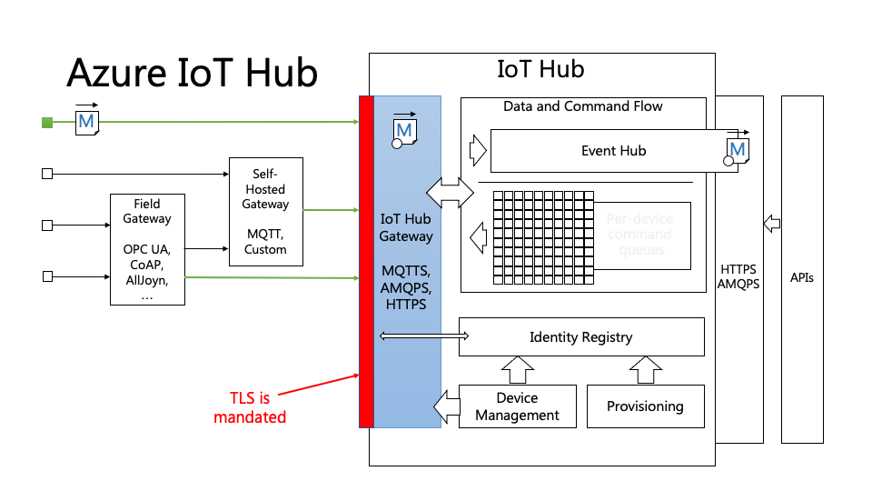

```
$ nmap poorlyfundedskynet.azure-devices.net -p 1883,5672,80
Starting Nmap 7.80 ( https://nmap.org ) at 2020-10-06 15:36 EEST
Nmap scan report for poorlyfundedskynet.azure-devices.net (40.118.27.192)
Host is up (0.15s latency).

PORT     STATE    SERVICE
80/tcp   filtered http
1883/tcp filtered mqtt
5672/tcp filtered amqp
```

```
$ sslscan poorlyfundedskynet.azure-devices.net
Version: 2.0.2-static
OpenSSL 1.1.1g  21 Apr 2020

Connected to 40.118.27.192

Testing SSL server poorlyfundedskynet.azure-devices.net on port 443 using SNI name poorlyfundedskynet.azure-devices.net

SSL/TLS Protocols:
SSLv2     disabled
SSLv3     disabled
TLSv1.0   enabled
TLSv1.1   enabled
TLSv1.2   enabled
TLSv1.3   disabled

[...]

Supported Server Cipher(s):
Preferred TLSv1.2  128 bits  ECDHE-RSA-AES128-SHA256       Curve P-256 DHE 256
Accepted  TLSv1.2  256 bits  DHE-RSA-AES256-GCM-SHA384     DHE 2048 bits
Accepted  TLSv1.2  128 bits  DHE-RSA-AES128-GCM-SHA256     DHE 2048 bits
Accepted  TLSv1.2  256 bits  AES256-GCM-SHA384
Accepted  TLSv1.2  128 bits  AES128-GCM-SHA256
Accepted  TLSv1.2  256 bits  AES256-SHA256
Accepted  TLSv1.2  128 bits  AES128-SHA256
Accepted  TLSv1.2  256 bits  ECDHE-RSA-AES256-SHA          Curve P-384 DHE 384
Accepted  TLSv1.2  128 bits  ECDHE-RSA-AES128-SHA          Curve P-256 DHE 256
Accepted  TLSv1.2  256 bits  AES256-SHA
Accepted  TLSv1.2  128 bits  AES128-SHA
Accepted  TLSv1.2  112 bits  TLS_RSA_WITH_3DES_EDE_CBC_SHA
Preferred TLSv1.1  256 bits  ECDHE-RSA-AES256-SHA          Curve P-384 DHE 384
Accepted  TLSv1.1  128 bits  ECDHE-RSA-AES128-SHA          Curve P-256 DHE 256
Accepted  TLSv1.1  256 bits  AES256-SHA
Accepted  TLSv1.1  128 bits  AES128-SHA
Accepted  TLSv1.1  112 bits  TLS_RSA_WITH_3DES_EDE_CBC_SHA
Preferred TLSv1.0  256 bits  ECDHE-RSA-AES256-SHA          Curve P-384 DHE 384
Accepted  TLSv1.0  128 bits  ECDHE-RSA-AES128-SHA          Curve P-256 DHE 256
Accepted  TLSv1.0  256 bits  AES256-SHA
Accepted  TLSv1.0  128 bits  AES128-SHA
Accepted  TLSv1.0  112 bits  TLS_RSA_WITH_3DES_EDE_CBC_SHA
```

## Resources -

### Azure IoT Security
https://azure.microsoft.com/en-us/overview/iot/security/

### Azure IoT Hub Security Considerations
https://docs.microsoft.com/en-us/azure/iot-hub/iot-hub-devguide-security

### Choose a communication protocol
https://docs.microsoft.com/en-us/azure/iot-hub/iot-hub-devguide-protocols

### Azure IoT Security Talk (Clemens Vasters)
https://channel9.msdn.com/events/Build/2015/2-625
Slides: http://video.ch9.ms/sessions/build/2015/2-625.pptx

### The AMQP 1.0 Protocol (6 parts, Clemens Vasters)
https://channel9.msdn.com/Blogs/Subscribe/The-AMQP-10-Protocol-16-Overview

### A Comparison of AMQP and MQTT (from StormMQ)
https://lists.oasis-open.org/archives/amqp/201202/msg00086/StormMQ_WhitePaper_-_A_Comparison_of_AMQP_and_MQTT.pdf

### Enforce minimum TLS version on Azure IoT Hub
https://docs.microsoft.com/en-us/azure/iot-hub/iot-hub-tls-support

### Deprecation of TLS 1.0 and 1.1 in IoT Hub
https://docs.microsoft.com/en-us/azure/iot-hub/iot-hub-tls-deprecating-1-0-and-1-1

